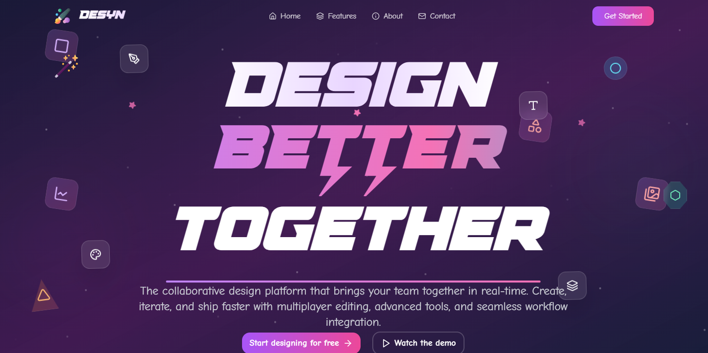

# Desyn 

## Overview
Welcome to Desyn – a next-gen collaborative design and brainstorming platform built for creators, teams, and innovators. Whether you're sketching out an idea, building a UI concept, or collaborating in real-time, our powerful feature set ensures you stay productive, creative, and connected.

With intuitive tools like multi-user cursors, live chat, freeform drawing, and commenting, along with shape creation, image uploads, and robust customization options – your canvas becomes a dynamic space for real-time ideation and feedback.

Designed for efficiency and creativity, this tool brings together the best of design interactivity and development power with advanced support for keyboard shortcuts, action history, undo/redo, and full canvas control. From expressive drawing to precise editing – it’s all here.

## 🎨 Preview


## 🚀 Features
✅ Multi Cursors, Cursor Chat, and Reactions 🖱️💬🎉
Allows multiple users to collaborate simultaneously by showing individual cursors, enabling real-time chat, and reactions for interactive communication.

✅ Active Users 🟢👥
Displays a list of currently active users in the collaborative environment, providing visibility into who is currently engaged.

✅ Comment Bubbles 💭📝
Enables users to attach comments to specific elements on the canvas, fostering communication and feedback on design components.

✅ Creating Different Shapes 🔷🔶📐
Provides tools for users to generate a variety of shapes on the canvas, allowing for diverse design elements.

✅ Uploading Images 🖼️📤
Import images onto the canvas, expanding the range of visual content in the design.

✅ Customization 🎨⚙️
Allows users to adjust the properties of design elements, offering flexibility in customizing and fine-tuning visual components.

✅ Freeform Drawing ✏️🖍️
Enables users to draw freely on the canvas, promoting artistic expression and creative design.

✅ Undo/Redo ↩️↪️
Provides the ability to reverse (undo) or restore (redo) previous actions, offering flexibility in design decision-making.

✅ Keyboard Actions ⌨️⚡
Allows users to utilize keyboard shortcuts for various actions, including copying, pasting, deleting, and triggering shortcuts for features like opening cursor chat, reactions, and more — enhancing efficiency and accessibility.

✅ History 🕰️📜
Review the chronological history of actions and changes made on the canvas, aiding in project management and version control.

✅ Deleting, Scaling, Moving, Clearing, Exporting Canvas 🗑️📏🧲🧹📤
Offers a range of functions for managing design elements, including deletion, scaling, moving, clearing the canvas, and exporting the final design for external use.

...and many more, including code architecture 🧱, advanced React hooks 🪝, and reusability ♻️ for optimized performance and modularity.

## 🖥️ Live Demo
Check out the live version of Desyn here: [Live Site](https://desyn.vercel.app/)

---

## 🤸 Quick Start

Follow these steps to set up the project locally on your machine.

**Prerequisites**

Make sure you have the following installed on your machine:

- [Git](https://git-scm.com/)
- [Node.js](https://nodejs.org/en)
- [npm](https://www.npmjs.com/) (Node Package Manager)

**Cloning the Repository**

```bash
git clone https://github.com/Sankalp20Tiwari/desyn.git
cd desyn
```

**Installation**

Install the project dependencies using npm:

```bash
npm install
```
**Set Up Environment Variables**

Create a new file named `.env.local` in the root of your project and add the following content:

```env
NEXT_PUBLIC_LIVEBLOCKS_PUBLIC_KEY=
```

Replace the placeholder values with your actual Liveblocks credentials. You can obtain these credentials by signing up on the [Liveblocks website](https://liveblocks.io).

**Running the Project**

```bash
npm run dev
```

Open [http://localhost:3000](http://localhost:3000) in your browser to view the project.


---

## ⚙️ Tech Stack
- Nextjs
- React.js
- Tailwind CSS
- fabricjs
- Liveblocks
- shadcn/ui
---

## 📂 Project Structure
```
/desyn
├──app/
    ├──App.tsx      # Main app files
    ├──globals.css  # CSS styles
    ├──layout.tsx   # Layout file for app
    ├──page.tsx     # Entry point
    ├──Room.tsx     # Liveblocks Room
├── components      # Reusable UI components
├── constants/      # Static content and texts
├── hooks/          # Custom react hooks
├── lib/            # Utility functions 
├── public/         # Static assets (icons, images, etc.)
├── types           # Type declaration
└── package.json
└── tailwind.config.ts # Config files for tailwind
└── liveblocks.config.ts # Config files for liveblocks
```

---

## 🤝 Contributing
We welcome contributions! To contribute:
1. **Fork** the repository
2. **Create a new branch** (`git checkout -b feature-name`)
3. **Commit your changes** (`git commit -m 'Add feature'`)
4. **Push to your branch** (`git push origin feature-name`)
5. Create a **Pull Request** 🚀

---

